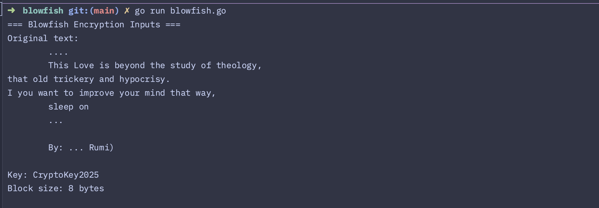
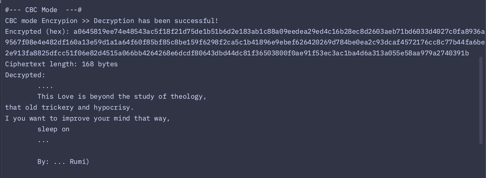
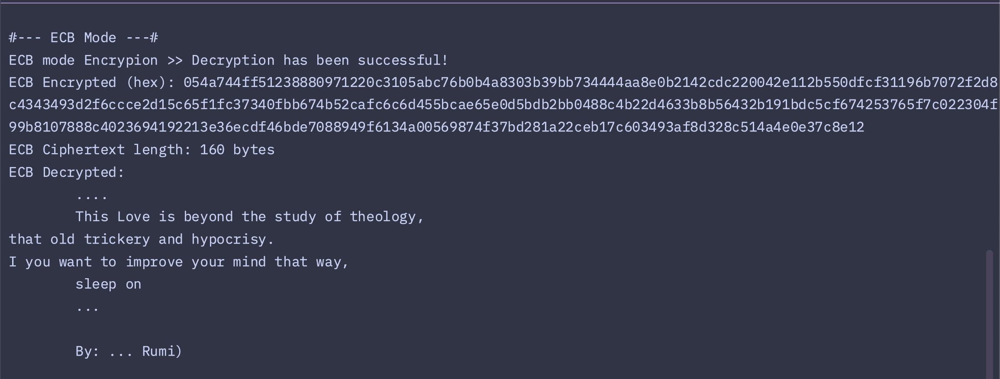
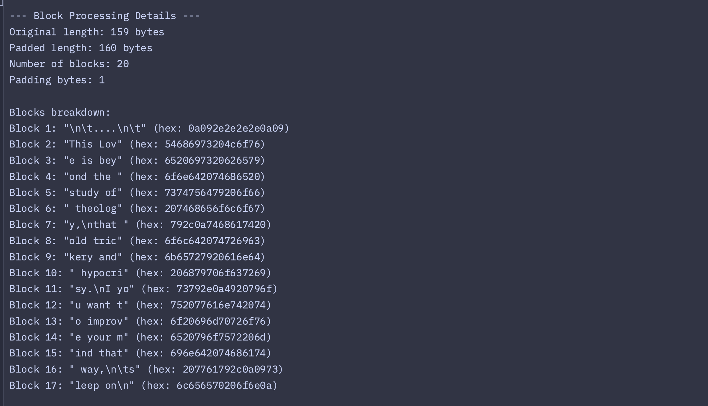

## Blowfish modes

### ECB is insecure because:

 - Reveals patterns in data
 - Same plaintext → Same ciphertext
 - Blocks can be rearranged
 - Vulnerable to statistical analysis

### CBC (Cipher Block Chaining)

_Each plaintext block is XORed with the previous ciphertext block before encryption_
 - Masks all patterns through chaining
 - Same plaintext → Different ciphertext (via random IV) -- randomization
 - Changes cascade through entire message
 - Each encryption is unique


### Running the Code
```bash
go run blowfish.go
```

#### Screenshots
Blowfish Inputs


Blowfish CBC mode


Blowfish ECB mode


Blowfish Blocks Processing

